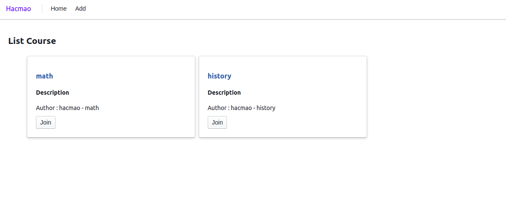
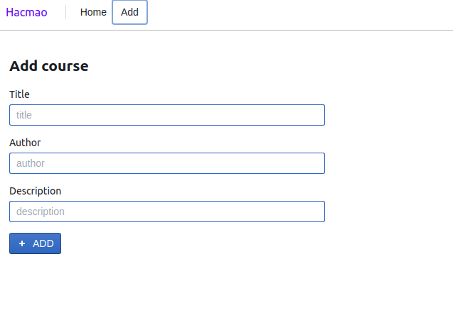

# React course application with graphql





## Graphql

Sample apollo express server.  

```js
const app = express();

const server = new ApolloServer({typeDefs, resolvers, context});

server.applyMiddleware({ app });

app.listen({ port : 4000 }, () => { 
    console.log(`Server ready at http://localhost:4000${server.graphqlPath}`);
});
```

### typeDefs & resolvers

```js
const typeDefs = gql`
    input CourseInput {
        title: String,
        author: String,
        description: String
    }

    type Course {
        title: String,
        author: String,
        description: String
    }

    type Query {
        courses: [Course]
    }

    type Mutation {
        setCourse(new_course : CourseInput): Course  
    }
`;

const resolvers = {
    Query: {
        courses: () => course
    },
    Mutation: {
        setCourse: (parent, { new_course }, { db }) => {
            db.push(new_course);
            return new Course(new_course);
        }
    }
}
```

Query & mutation in client have following form:  

```js
gql`query {
    courses {
        title
        author
        description
    }
}`

gql`
  mutation setCourse(
    $title : String, 
    $author: String,
    $description: String
  ){
    setCourse(new_course: {title: $title, author: $author, description: $description}) {
      title
    } 
  }
```

## Front-end

Use library [blueprintjs](https://blueprintjs.com/docs/versions/2/#core/components/).  

