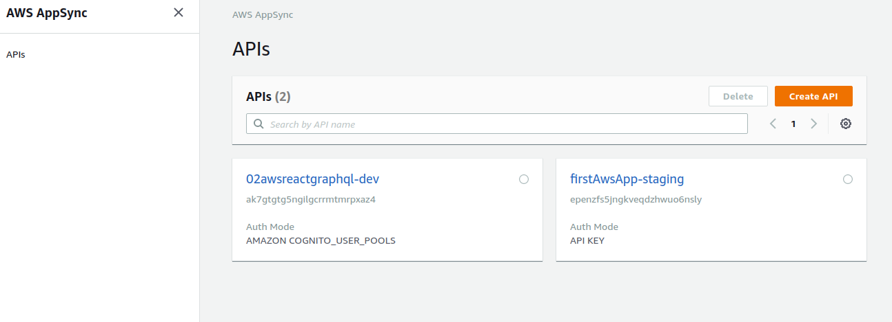
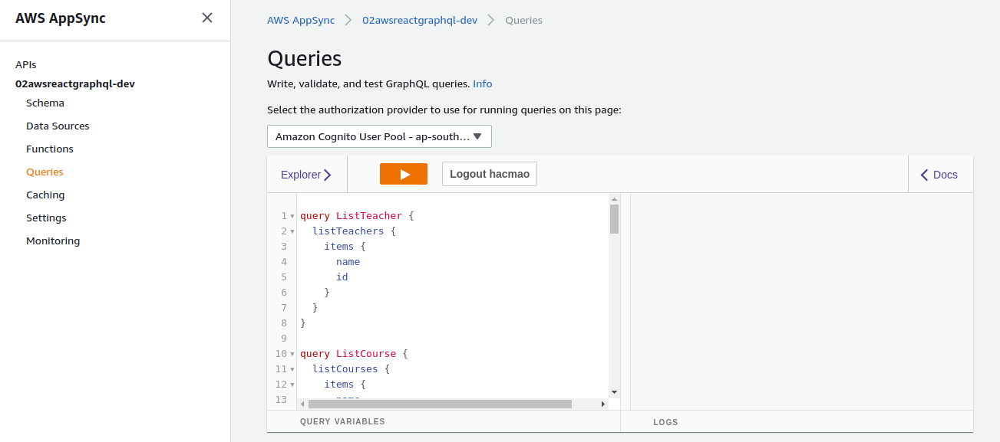
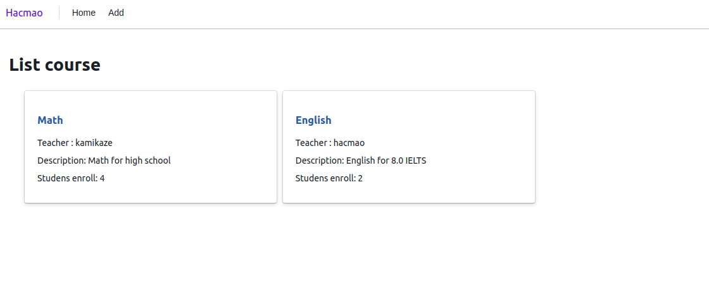
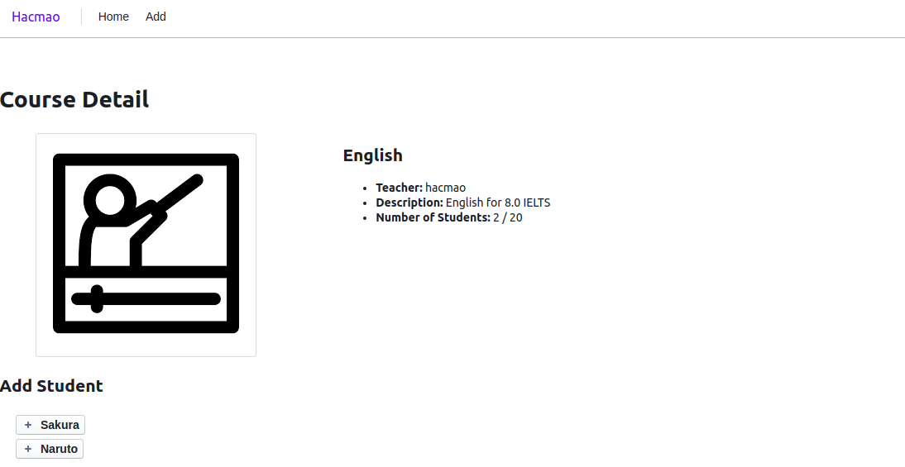
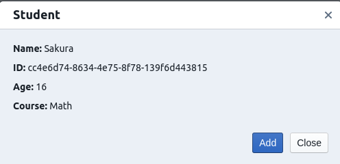

# Appsync application  

## Introduction  

This is an improvement of course application in previous project. In previous project, we use only one table with no relation. Build in apollo-express-server.  

In this project, we will learn how to develop an react application which backend is graphQL.  

There are 3 aws components we will use in this project :  

+ Amplify  
+ Appsync  
+ Cognito

Appsync is an aws application to develop API graphql. When we use amplify to add graphQL api, it will assign to appsync.  

  

Cognito is an authentication application. We will just use this default authentication, not dive into authen mode in this project.  

## Setup

First, we init our project to create a simple react webapp.  
Then, with `amplify-cli`, in the react's folder, we execute the following command:  

```bash
amplify init
amplify add api
```

Choose graphQL, then choose authentication is Cognito. Attach `AWSAppSyncAdministrator` permissions with current IAM user.  

In `App.js`, load aws configure :  

```js
import awsconfig from './aws-exports.js'
import Amplify, { Auth } from 'aws-amplify';

Amplify.configure(awsconfig);
Auth.configure(awsconfig);
```

## GraphQL Schema  

In this project, we will build 4 model :  

+ Student  
+ Teacher
+ Course
+ Manager

With following relations :  

+ 1-M : Teacher - Course
+ Belongs to : Course - Teacher  
+ M-N : Course - Student

For how to create these relations , read [article](https://docs.amplify.aws/cli/graphql-transformer/connection) in aws's blog.  

To check systax :  

```bash
amplify api gql-compile
```

Aws will automatic create query, mutation, subscriptions for us in `src/graphql`. Just export then query:  

```js
import { API, graphqlOperation } from "aws-amplify";

const res = await API.graphql(graphqlOperation(getCourse, {id : courseId}));
```

We can test query directly in [AppSync](https://ap-southeast-1.console.aws.amazon.com/appsync/).  

  

## Demo  

In this application, I developed the following functions :  

+ List course

  

+ Course detail  

  

+ Add student to course  

  

We can improve many other functions like :  

+ List teacher
+ List student
+ Add course, teacher, student

But for learning graphQL with amplify, this is enough.  
