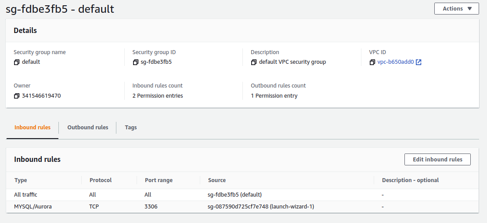
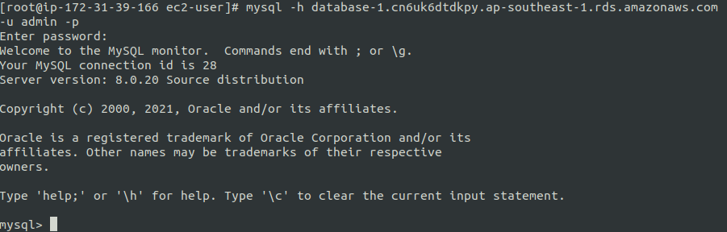

# Relation database service

MySQL, PosgreQL, Mariadb, ...  

Connect to [RDS console](https://ap-southeast-1.console.aws.amazon.com/rds), then create a new rds database.  

After that, edit security group `Inbound` rule to allow our EC2 to connect with our data base.  

  

  
