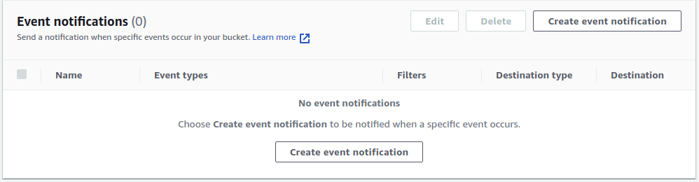
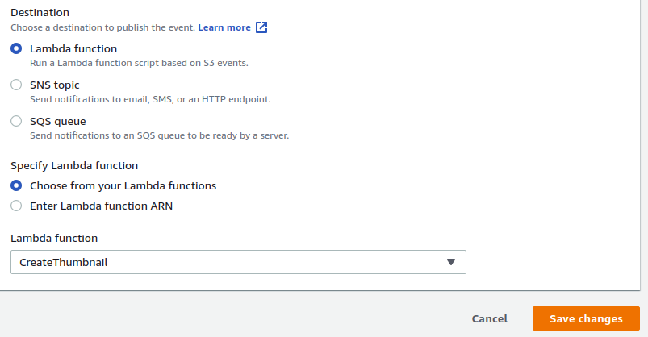
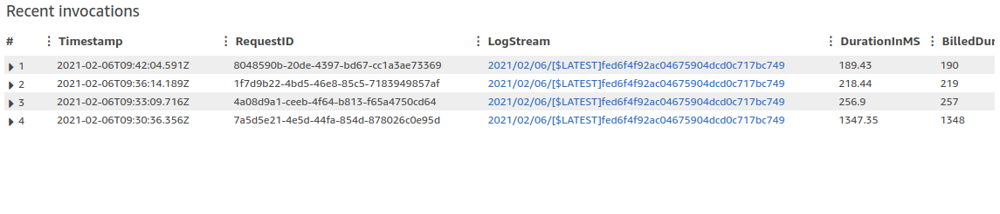
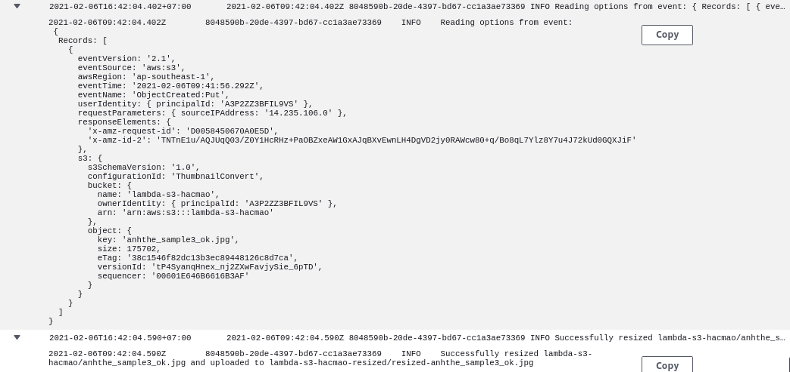

# Create Simple lambda function connect with S3  

[Tutorial](https://docs.aws.amazon.com/lambda/latest/dg/with-s3-example.html)  

In this tutorial, we will create a lambda function to create thumbnail image of an existing image.  

Components :  

+ Lambda  
+ S3
+ IAM
+ CLoud Watch  

## Create bucket  

First, we create 2 bucket:  

+ Image
+ Image-resized

We will upload image into `Image` Bucket, then trigger our lambda function to convert image to small size image, then save to `Image-resized`.  

## Create IAM policy  

Then, create IAM policy to access `Cloud Watch` to view console log.  

```json
{
    "Effect": "Allow",
    "Action": [
        "logs:PutLogEvents",
        "logs:CreateLogGroup",
        "logs:CreateLogStream"
    ],
    "Resource": "arn:aws:logs:*:*:*"
}
```

Create IAM policy to access 2 above bucket.  

```json
{
    "Effect": "Allow",
    "Action": [
        "s3:GetObject"
    ],
    "Resource": "arn:aws:s3:::mybucket/*"
},
{
    "Effect": "Allow",
    "Action": [
        "s3:PutObject"
    ],
    "Resource": "arn:aws:s3:::mybucket-resized/*"
}
```

## Create execution role

Create [Execution role](https://docs.aws.amazon.com/lambda/latest/dg/lambda-intro-execution-role.html) for our lambda functions.  

Create a role with the following properties.

+ Trusted entity – AWS Lambda.  
+ Permissions – AWSLambdaS3Policy <-- Policy which we created in the previous step  
+ Role name – lambda-s3-role  

## Create lambda function  

Create a new folder, then install dependecy.  
Edit code in file `index.js`.  

Zip all files in current directory, includes `node_modules` folder.  

Submit function :  

```bash
aws lambda create-function --function-name CreateThumbnail \
--zip-file fileb://LambdaS3Function.zip --handler index.handler --runtime nodejs12.x \
--timeout 10 --memory-size 1024 \
--role arn:aws:iam::341546619470:role/lambda-s3-role \
--cli-binary-format raw-in-base64-out
```

Update function :  

```bash
aws lambda update-function-code --function-name CreateThumbnail --zip-file fileb://LambdaS3Function.zip --cli-binary-format raw-in-base64-out
```

## Add S3 event notification  

In `S3` console, source bucket, `Properties` tab.  

  

  

  

## View Logs  

In the `Lambda` function, `Monitoring` tab :  

  

Click into `LogStream` url:  

  

We can find all event, console log of all request.  
