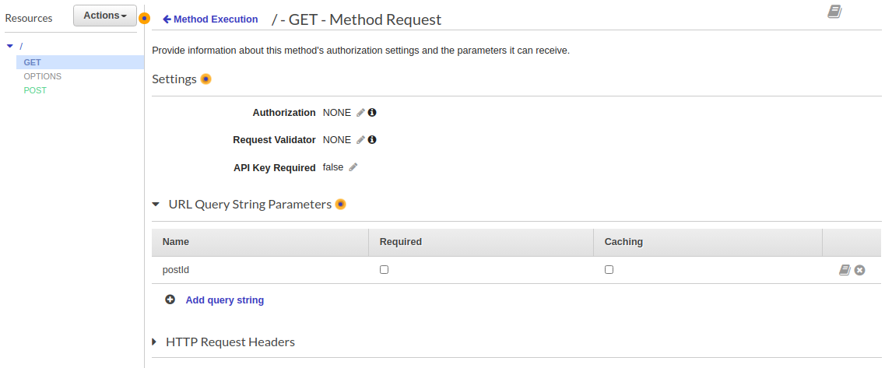

# Lambda  

## Version control

+ Multiple version
+ Lastest version : $LASTEST
+ Versions is immutable
+ Can split traffic using alias to different version (except $lastest)

## Trigger  

We can add trigger to call lambda function by :  

+ Data change in S3, Dynamodb
+ API gateway

## Pass parameter to lambda functions with REST API  

[Tutorial](https://docs.aws.amazon.com/apigateway/latest/developerguide/integrating-api-with-aws-services-lambda.html)

  

In the `GET - Integration Request`, set Mapping templates :  

```json
{
    "postId":"$input.params('postId')"
}
```

In lambda function, take value of `postId` :  

```python
postId = event["postId"]
```

## Step functions  

+ Great way to visualize serverless application
+ Automatically triggers and tracks each step
+ Log state of each step

## X-Ray

+ collects data about requests that your application serves
+ provides tools you can use to view, filter, and gain insights into that data to identify issues and opportunities for optimization.

