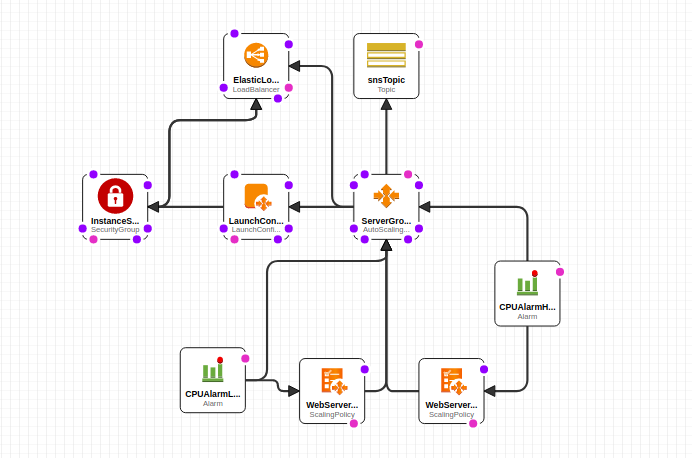

# Readme

This cloudformation is a simple [example](https://docs.aws.amazon.com/AWSCloudFormation/latest/UserGuide/example-templates-autoscaling.html) to create an autoscaling web server which contain the following component :  

  

This example creates an autoscaling group to launch EC2 instances based on CPU usage. Cloud watch will consider CPU of Auto scaling group, if it is too high or too low, it will perform `ScalingPolicy` to increase or decrease number of EC2 instances in Auto Scaling group.  

## Create SNS topic  

[Sample](https://docs.aws.amazon.com/AWSCloudFormation/latest/UserGuide/quickref-sns.html)  

First, create a `OperatorEmail` parameter :  

```json
"OperatorEmail": {
    "Description": "Email to send notification",
    "Type": "String",
    "AllowedPattern": "([a-zA-Z0-9_\\-\\.]+)@((\\[[0-9]{1,3}\\.[0-9]{1,3}\\.[0-9]{1,3}\\.)|(([a-zA-Z0-9\\-]+\\.)+))([a-zA-Z]{2,4}|[0-9]{1,3})(\\]?)",
    "ConstraintDescription": "Not a valid email"
}
```

Then create an SNS to send to target email :  

```json
"snsTopic": {
    "Type": "AWS::SNS::Topic",
    "Properties": {
    "Subscription": [
        {
        "Endpoint": {
            "Ref": "OperatorEmail"
        },
        "Protocol": "Email"
        }
    ]
    }
```

## Create LoadBalancer  

```json
"ElasticLoadBalancer": {
    "Type": "AWS::ElasticLoadBalancing::LoadBalancer",
    "Properties": {
    "AvailabilityZones": {
        "Fn::GetAZs": ""
    },
    "CrossZone": "true",
    "Listeners": [
        {
        "LoadBalancerPort": "80",
        "InstancePort": "80",
        "Protocol": "HTTP"
        }
    ],
    "HealthCheck": {
        "Target": "HTTP:80/",
        "HealthyThreshold": "3",
        "UnhealthyThreshold": "5",
        "Interval": "30",
        "Timeout": "5"
    }
    },
}
```

This `LoadBalancer` perform healthcheck with timeout 5 seconds.  

## Create LoadConfigure for Auto scaling group  

`AWS::AutoScaling::LaunchConfiguration` is the configure of each EC2 instance which will be created in Auto scaling group. We can configure these EC2 instance.  

### Metadata  

```json
"LaunchConfig": {
    "Type": "AWS::AutoScaling::LaunchConfiguration",
    "Metadata": {
        "Comment": "Install a simple application",
        "AWS::CloudFormation::Init": {
            "config": {
                "packages" : {
                    "yum": {
                        "httpd": []
                    }
                },
                "files": {
                    ...
                },
                "services": {
                    ...
                }
            }
        }
    }
}
```

Metadata contains init setup in EC2 instance like package which will be installed, or files, serivces, ...  

There are 2 default files which we must config : `/etc/cfn/cfn-hup.conf` and `/etc/cfn/hooks.d/cfn-auto-reloader.conf`, which will be used to run `cfn-hup`.  

### Importance properties  

+ `KeyName`
+ `ImageId`
+ `SecurityGroups`
+ `InstanceType`
+ `Userdata`

`UserData` is user's command which will be runed in EC2 instance when it is created. We must install `aws-cfn-bootstrap` to get `cfn` scripts. These scripts will help us to run metadata setup in `AWS::CloudFormation::Init`.  

+ `cfn-init` : create file, run commands in `AWS::CloudFormation::Init`.  
+ `cfn-signal` : send success or fail signal to Auto scaling group.  

## Create Auto scaling group  

+ `AutoScalingGroupName`
+ `AvailabilityZones`:  

```json
"AvailabilityZones": {
    "Fn::GetAZs": ""
},
```

+ `LaunchConfigurationName` : the launch configure which we setup in previous step.
+ `MinSize` and `MaxSize`
+ `LoadBalancerNames`
+ `NotificationConfiguration`:  

```json
"NotificationConfiguration": {
    "TopicARN": {
        "Ref": "snsTopic"
    },
    "NotificationTypes": [
        "autoscaling:EC2_INSTANCE_LAUNCH",
        "autoscaling:EC2_INSTANCE_LAUNCH_ERROR",
        "autoscaling:EC2_INSTANCE_TERMINATE",
        "autoscaling:EC2_INSTANCE_TERMINATE_ERROR"
    ]
}
```

+ `CreationPolicy` :  

```json
"CreationPolicy": {
    "ResourceSignal": {
        "Count": "1",
        "Timeout": "PT15M"
    }
}
```

Auto scaling group will be created successfull when receive atleast 1 successful signal in 15 minutes.  

## Create CloudAlarm based on CPU Ultilizations

```json
"WebServerScaleDownPolicy": {
    "Type": "AWS::AutoScaling::ScalingPolicy",
    "Properties": {
    "AdjustmentType": "ChangeInCapacity",
    "AutoScalingGroupName": {
        "Ref": "ServerGroup"
    },
    "Cooldown": "60",
    "ScalingAdjustment": "-1"
    }
},
"CPUAlarmLow": {
    "Type": "AWS::CloudWatch::Alarm",
    "Properties": {
    "AlarmDescription": "Scale-down if CPU < 70% for 10 minutes",
    "MetricName": "CPUUtilization",
    "Namespace": "AWS/EC2",
    "Statistic": "Average",
    "Period": "300",
    "EvaluationPeriods": "2",
    "Threshold": "70",
    "AlarmActions": [
        {
            "Ref": "WebServerScaleDownPolicy"
        }
    ],
    "Dimensions": [
        {
        "Name": "AutoScalingGroupName",
        "Value": {
            "Ref": "ServerGroup"
        }
        }
    ],
    "ComparisonOperator": "LessThanThreshold"
}
```
