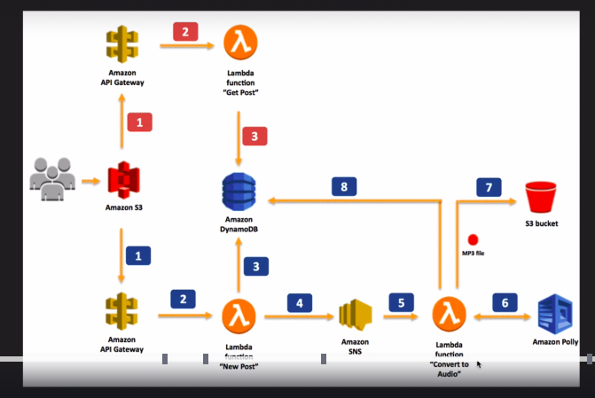
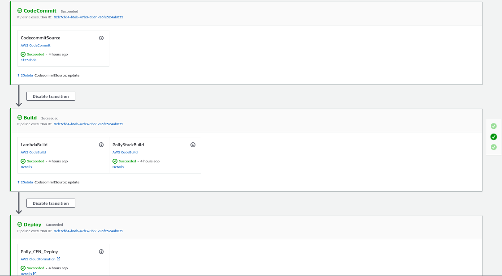
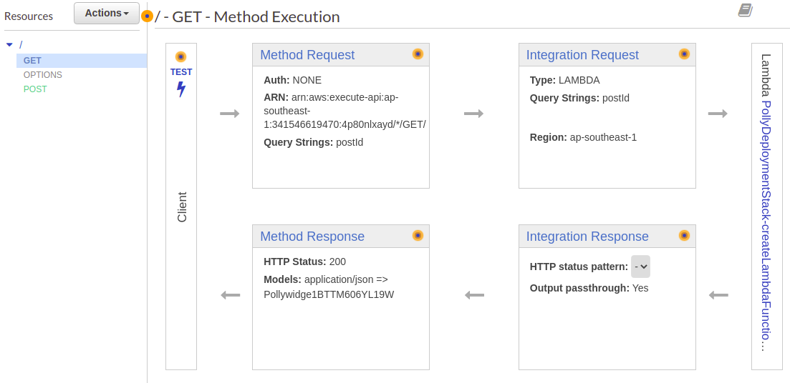

# Polly example  

Ví dụ này viết lại từ một ví dụ của udemy dưới dạng CDK. Nó bao gồm các thành phần như sơ đồ sau :  

  

## Xây dựng pipeline  

Dựa trên kinh nghiệm của phần trước, ta sẽ xây dựng một pipeline để build code tự động. Tuy nhiên, lần này cần xây dựng một stack có 3 lambda function, chúng ta có thể làm theo hướng dẫn trên [github](https://github.com/aws/aws-cdk/issues/6965#issuecomment-604523266)  

  

Trong khi build lambda function, việc khó khăn là chúng ta cần install các package. Để install package với nodejs khá dễ dàng khi chỉ cần upload cùng với thư mục `node_modules` là xong. Tuy nhiên, với python thì phức tạp hơn một chút:  

```yml
version: 0.2
run-as: root

phases:
  install:
    commands:
      - curl -sS https://dl.yarnpkg.com/debian/pubkey.gpg | apt-key add -
      - apt-get update
      - apt-get install zip
  pre_build:
    commands:
      - cd lambda
      - ls
      - pip install virtualenv
      - chmod +x build_package.sh
  build:
    commands:
      - cd getPosts
      - ../build_package.sh getposts
      - cd ../newPost
      - ../build_package.sh newpost 
      - cd ../converToAudio 
      - ../build_package.sh convertoaudio
artifacts:
  secondary-artifacts:
    GetPostOutput:
      base-directory: lambda/getPosts/tmp
      files:
        - '**/*'
    NewPostOutput:
      base-directory: lambda/newPost/tmp 
      files:
        - '**/*'
    ConverToAudioOutput:
      base-directory: lambda/converToAudio/tmp
      files:
        - '**/*'
```

Chúng ta cần install một virtual enviroment, install các thư viện xong copy các thư viện đó cùng với file thực thi chính.  

Tuy nhiên, sau khi trải qua các thể loại thiết lập trên, mình tìm được một thư viện `@aws-cdk/aws-lambda-python` có hỗ trợ luôn các setup trên. :)  

## Xây dựng Polly Stack  

Đây là stack chính để xây dựng lên ứng dụng của chúng ta.  
Các thành phần đơn giản như S3, SNS, Dynamodb khá là dễ xây dựng, hoàn toàn dựa trên doc của cdk là đủ.  

### Cách thức hoạt động của APP  

+ `GET` request tới API gateway để gọi `getPosts.py` lambda function, thực hiện lấy dữ liệu từ dynamodb, hiển thị cho người dùng.  
+ `POST` request tới API gateway để tạo mới 1 post. Gọi `newpost.py` để tạo một item mới trong dynamodb, thực hiện publish một message tới `sns topic`.
+ `SNS` topic sẽ trigger `convertoaudio` function, tại đây, sẽ tiến hành gọi `Polly` để chuyển văn bản thành giọng nói rồi lưu tới S3
+ `Static web` để thực hiện tất cả các điều trên.

### Lambda function  

Chúng ta cần xây dựng 3 lambda function nên mình đã viết 1 `lambda-service.ts` để giúp cho việc tạo function đồng thời cấp các quyền thích hợp cho function.  

Trong trường hợp này, chúng ta cần quyền truy cập S3, Polly, CloudWatch.  

### API gateway  

Ta cần 1 API gateway gồm `GET /` và `POST /`.  

Tạo api gateway:  

```js
const api = new RestApi(this, "widgets-api", {
    restApiName: "Polly cdk api",
    description: "This service is for polly app.",
    defaultCorsPreflightOptions: {
    allowOrigins: Cors.ALL_ORIGINS,
    allowMethods: Cors.ALL_METHODS,
    allowHeaders: Cors.DEFAULT_HEADERS
    }
});
```

Tiếp đến, chúng ta cần tạo các method có các `lambda` integration tương ứng. Các thành phần của một method trong api gateway sẽ có dạng như sau:  

  

Bao gồm 4 thành phần chính mà ta sẽ setup:  

+ `Method request` :  bao gồm có query parameter, body request, ...
+ `Integration request`: cấu hình mapping từ method tới lambda function.
+ Method response
+ Integration reponse  

Trước tiên, tạo một model định dạng dữ liệu trả về :  

```ts
const responseModel = api.addModel('SuccessModel', {
    contentType: 'application/json',
    schema: {
    schema: JsonSchemaVersion.DRAFT4,
    title: 'SuccessModel',
    type: JsonSchemaType.OBJECT,
    }
});
```

Tiếp đến, tạo `LambdaIntegration` :  

```ts
const getPostIntegration = new LambdaIntegration(getPostFunc, {
    proxy: false,
    
    requestParameters: {
        'integration.request.querystring.postId': 'method.request.querystring.postId'
    },
    requestTemplates: { 
    "application/json": JSON.stringify({ "postId": "$util.escapeJavaScript($input.params('postId'))" }) 
    },
    integrationResponses: [
    {
        statusCode: '200',
        responseTemplates: {
            'application/json': ''
        }
    }
    ]
});
```

Định danh các thành phần sau :  

+ `proxy`: `false`
+ `requestParameters`: trong `LambdaIntegration` là một mapping từ `request` tới `lambda function`. [ref](https://docs.aws.amazon.com/apigateway/latest/developerguide/request-response-data-mappings.html) Có nhiều trường hợp cần mapping phức tạp hơn, tham khảo [template](https://stackoverflow.com/questions/31372167/how-to-access-http-headers-for-request-to-aws-api-gateway-using-lambda/33602122#33602122).  
+ `integrationResponses`: mô tả các lambda sẽ trả về, ta sẽ để rỗng, mặc định sẽ trả về kết quả return của lambda function.  

Muốn tạo một mapping template trong `requestParameters`, đầu tiên ta phải tạo `parameter` trong `method request` :  

```ts
api.root.addMethod('GET', getPostIntegration, {
    requestParameters: {
        'method.request.querystring.postId': true,
    },
    methodResponses: [
    {
        statusCode: '200',
        responseModels: {
            'application/json': responseModel
        }
    }
    ],
});
```

## Host static app  

Tạo một bucket có thể host web :  

```ts
const hostBucket = new S3.Bucket(this, 'hostPollyBucket', {
      removalPolicy: cdk.RemovalPolicy.DESTROY,
      publicReadAccess: true,
      websiteIndexDocument: 'index.html'
    });
```

Lấy `api endpoint` sau khi cloudformation stack được tạo thành công, thay vào trong file `script.js` rồi upload lên S3 host web vừa tạo được. :)) Dù có pipeline nhưng vẫn phải làm đoạn thủ công này.  

Đồng thời enable lại CORS của api endpoint, cái setup CORS cho api endpoit của mình có chút vấn đề :)  

Đồng thời một kinh nghiệm rút ra là không nên dùng pipeline, build một lần mất tới ~ `6p30s`, dù đã dùng cả cache lại còn tốn tiền nữa.  
